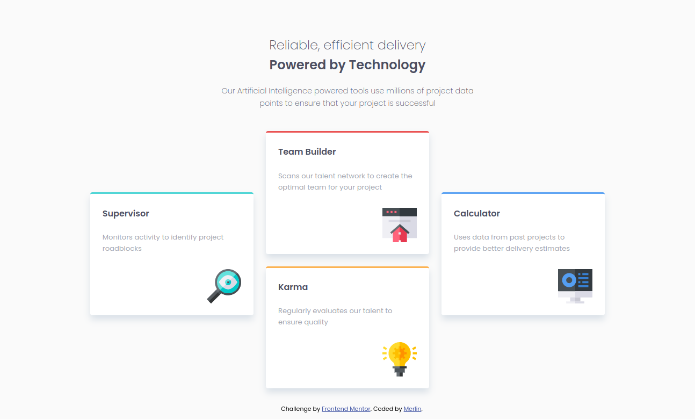

# Frontend Mentor - Four card feature section solution

This is a solution to the [Four card feature section challenge on Frontend Mentor](https://www.frontendmentor.io/challenges/four-card-feature-section-weK1eFYK). Frontend Mentor challenges help you improve your coding skills by building realistic projects. 

## Overview

### Screenshot

### Links

- Solution URL: [Github URL](https://github.com/merlin1101/four-card-feature-section)
- Live Site URL: [Four card feature section](https://merlin1101.github.io/four-card-feature-section/)

## Author

- Website - [Merlin Ponnachan](https://github.com/merlin1101/four-card-feature-section)
- Frontend Mentor - [@merlin1101](https://www.frontendmentor.io/profile/merlin1101)
